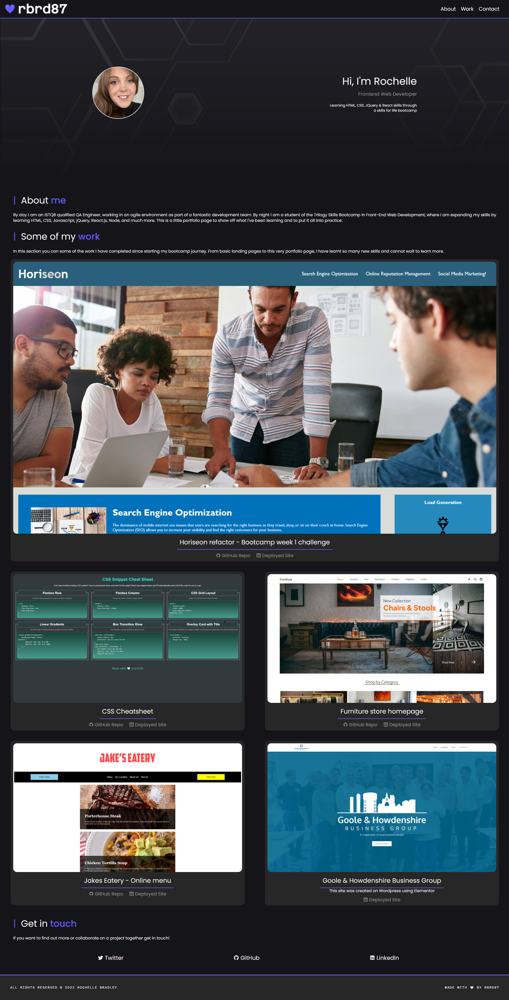

# My Portfolio

## Description
For this weeks bootcamp challenge, we were asked to build a portfolio page to showcase the skills we had learnt in the first couple of weeks of our course. We were to apply the core skills of using flexbox, media queries and CSS variables to create a responsive and professional looking portfolio page. 

To guide us, we were given a list of Acceptance Criteria to ensure the critical requirements were met. They are as follows:
- When the page is loaded the page presents your name, a recent photo or avatar, and links to sections about you, your work, and how to contact you
- When one of the links in the navigation is clicked then the UI scrolls to the corresponding section
- When viewing the section about your work then the section contains titled images of your applications
- When presented with the your first application then that application's image should be larger in size than the others
- When images of the applications are clicked then the user is taken to that deployed application
- When the page is resized or viewed on various screens and devices then the layout is responsive and adapts to my viewport

## Challenges / Learning Points
For me there were a lot of challenges with this task, but I overcame a lot of them by planning ahead using a simple wireframe (which you can view in the screenshots), by using Stack Overflow, Google and W3Schools to find information on overcoming little obstacles. 

I researched 'REM' calculations for my font-sizing instead of pixels. After reading [Engage Interactive's blog on EM vs REM vs PX](https://engageinteractive.co.uk/blog/em-vs-rem-vs-px) I learnt that not everyone's browsers use default font-sizing. For instance someone who is visually impared might have their font size preferences set to 20px in their brower settings. By specifying the actual pixel value of fonts you are building it for your screen, but everyones screens are different. Therefore using 'rem' instead of 'px' allows you to build a more accessible friendly site. It also helps to scale the size of your site for media queries. 

For easy REM calculations for my font sizes I used [Aleksandr Hovannisyan's blog entry - The 62.5% Font Size Trick](https://www.aleksandrhovhannisyan.com/blog/62-5-percent-font-size-trick/) where you set the overall `font-size` property of the `html` to 62.5% (62.5% of the default 16px browser font size is 10px) and the `body` font-size back to 1.6rem.  

I used 'rem' for all of my margins and padding, however in future I believe I should use 'em' or perhaps '%' but that is something to learn and play around with after I have researched it more.

Some other challenges with the styling of my site were as follows:

I wanted the navbar to remain in a fixed position when scrolling, but I found that when it scrolled down the page other elements would appear in front - I had to specify a higher `<z-index>` value to overcome this. 

I also found because I was using this type of navbar, when I selected a navigation link, the navbar would slightly cover the section header, using Stack Overflow I found a solution to create a container and add an anchor:
```
    <div> class="container"
        <a class="anchor" name="projects"></a>
    </div>
```
Solution: [Found here at Stack Overflow](https://stackoverflow.com/questions/67839180/navbar-covering-content-when-i-click-on-a-link-to-navigate-to-different-sections)

During this project I heavily relied on the Google Dev Tools to check for element positioning when creating my media queries but also when checking the `justify-content` properties. I think I will reply on that a lot more to ensure that my frontend design looks correct.

Further to that, I also found that I had to specify a `max-width` property on my site. As I use an Ultrawide Monitor, I couldn't ignore the fact my site would stretch to fill the entire screen and therefore would look ridiculous. I combated this by using `max-width` properties in my CSS code. I probably could have achieved this with media queries when I think about it now. Maybe that is something to look at in future!

## Useful Information
The page is deployed on GitHub - [Click here](https://rbrd87.github.io/my-portfolio/)

The repository of the project is also hosted on GitHub - [Click here](https://github.com/rbrd87/my-portfolio)

## Screenshots

Here is what the finished website looks like



Here you can also see the responsiveness of site due to the media queries used

<details>
  <summary>See tablet</summary>

  
  
</details>
<details>
  <summary>See mobile</summary>

  
  
</details>
<br>

Below is a snippet of HTML code, where you can see how I created my projects grid. Using links to take the user to the deployed sites but also using icons for further links etc. 


Here are some screenshots of my CSS code. 

This one highlights my use of 'rem' values for the font-sizing throughout my site.


And here is one showing how I used CSS to create the grid and used the `:first-child` CSS selector to make the first box in the grid bigger than the rest.


Finally, here is a wireframe I created in Balsamiq - a tool I have used for a number of years now in my System Analyst/Test Engineer roles.


## Credits

Without the help of the below blogs and Stack Overflow answer I would have probably gone down a very different route/rabbit hole - so I am mentioning them here in the credits!

- Engage Interactive's [blog on EM vs REM vs PX](https://engageinteractive.co.uk/blog/em-vs-rem-vs-px)
- Aleksandr Hovannisyan's [blog entry - The 62.5% Font Size Trick](https://www.aleksandrhovhannisyan.com/blog/62-5-percent-font-size-trick/)
- Fauntlreoy's [answer on Stack Overflow](https://stackoverflow.com/questions/67839180/navbar-covering-content-when-i-click-on-a-link-to-navigate-to-different-sections)

<br>
<br>
<div align=center>
<h3>The End</h3>
🤍
</div>